# Reto: "RED BUS"

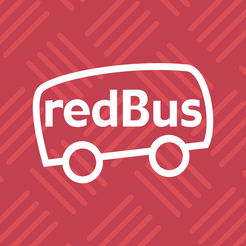

## Descripción

Empresa con la mayor plataforma online de venta de pasajes de buses interprovinciales a todo el Perú.

## Objetivo del reto UX

Brindar mayor conversión a las ventas realizadas en Pago Efectivo y Banca Online.

## Metodología utilizada

**Design Sprint**, método desarrollado por Google Ventures, es un proceso de cinco días que trata de responder las cuestiones críticas de un negocio a través del diseño, el prototipado y el testeo con los clientes.

## Desarrollo del reto

1. Conocer el desafío solicitado, identificar al equipo con quienes se trabajará el reto en diferentes tiempos, y planificar el tiempo y espacio a trabajar el reto.

2. Desarrollo del Design Sprint, en cinco días:

 ### DÍA 1
    
 #### Objetivo: Identificar el objetivo principal, que nos encaminará a la solución del reto.
 
 #### Actividades:

1. Establecer una meta a largo plazo, "Empezar por el final":

   * Mejorar la experiencia del usuario al realizar el pago efectivo y banca online de pasajes en redBus.

2. Identificar el objetivo N° 1, "¿Qué debe ser cierto?"

   * Disminuir los pasos de compra online y pago efectivo de los usuarios.

3. Transformar las hipótesis y obstáculos en preguntas, objetivo N° 1, "¿Cómo podemos convertir esto a una pregunta?"

   * ¿Somos capaces de disminuir los pasos de compra online y/o efectivo?.
   * ¿Será una experiencia agradable del usuario, disminuir los pasos de compra online y/o efectivo?.

4. Identificar el objetivo N° 2, "¿Qué debe ser cierto?"

   * Recaudar el 100% de los CIP generados por redBus.
      *Este objetivo se obtuvo luego de la pregunta a los expertos.*
    
5. Transformar las hipótesis y obstáculos en preguntas, objetivo N° 2, "¿Cómo podemos convertir esto a una pregunta?"
      
   * ¿Cómo se puede recaudar el 100% de los CIP generados por redBus?.
   * ¿Existirá una solución de recaudar el 100% de los CIP generados por redBus?.
    
6. Crear un mapa de procesos de redBus.
    
    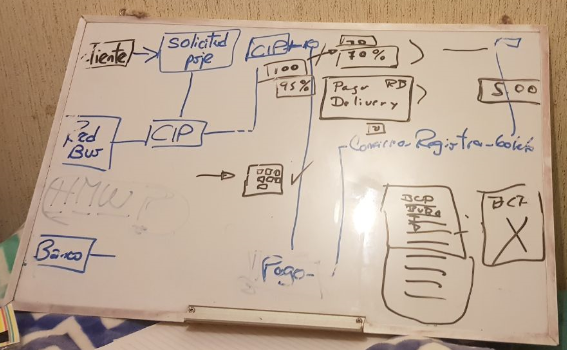
       *Este mapa se obtuvo luego de recopilar información, en la pregunta a los expertos.*
    
7. Preguntar a los expertos
      
    * Entrevista realizada a Juan Carbajal, gerente de IT de redBus, el día lunes 26 de marzo a las 11am, en sus propias instalaciones, se obtuvo:
    * Mapa de procesos de redBus, de pago online y pago efectivo:

    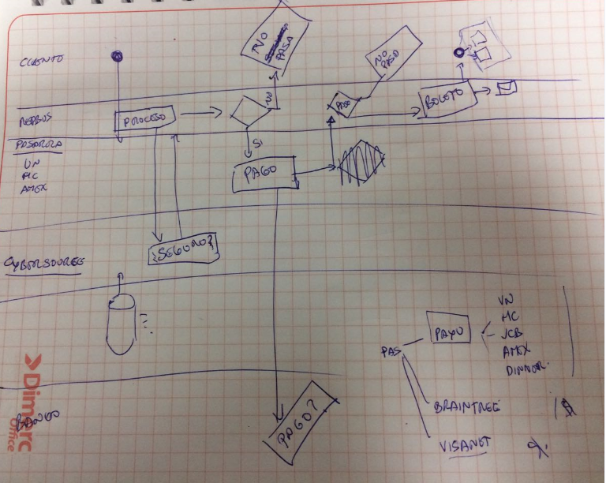
    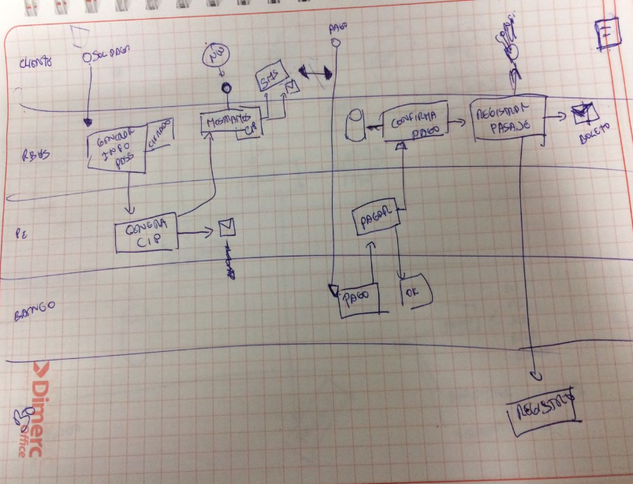
          
    * Ideas básicas obtenidas, en forma de preguntas:
        * ¿Cómo hacer para lograr mayor conversión de los pagos en efectivo, por parte de los usuarios?
        * ¿Cómo lograr para que los usuarios luego de haber obtenido su CIP paguen inmediatamente en banca online o efectivo?
        * ¿Cómo lograr para que los usuarios luego de haber obtenido su CIP paguen inmediatamente en banca online o efectivo?

8. How Migth We
      
    * Se realiza el HMW, colocando los post-its en diferentes lugares, para luego agruparlo según categorías:
      
    
      
    * Posterior se votan por los HMW de preferencia, los cuales serán colocados en el mapa de proceso.
      
    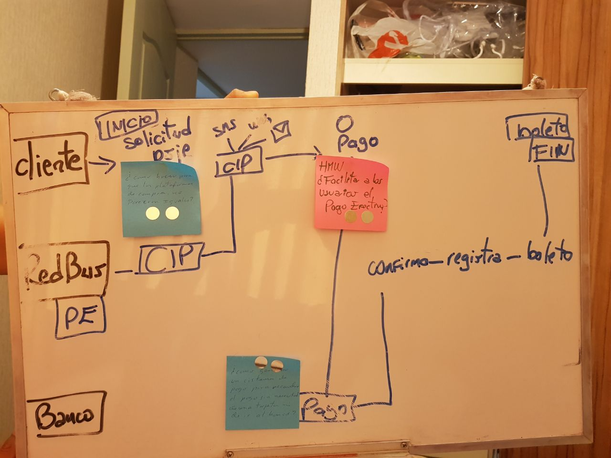

### DÍA 2
    
 #### Objetivo: Definir las posibles soluciones del reto.
 
 #### Actividades:

1. Identificar servicios o productos de otras empresas, que brinden inspiración. "Mezclar y mejorar"
       
    * *Parecido al benchmark, con la diferencia de que se toman los productos o servicios para integrarlo en nuestro proyecto*
            
    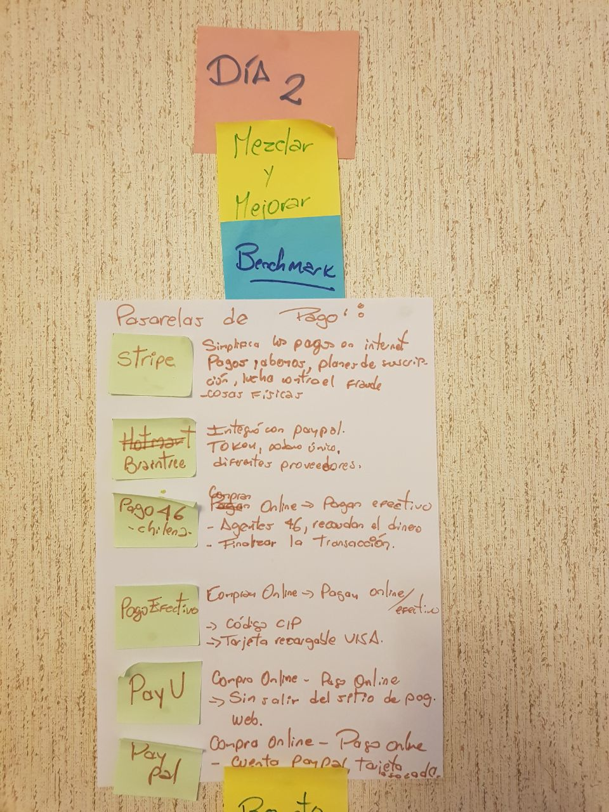
        
    * Posterior se votan por los HMW de preferencia, los cuales serán colocados en el mapa de proceso.
      
2. Definir las posibles soluciones a través de dibujos "Esbozar"
    
    * Se realiza el desvarío en 8:
        
    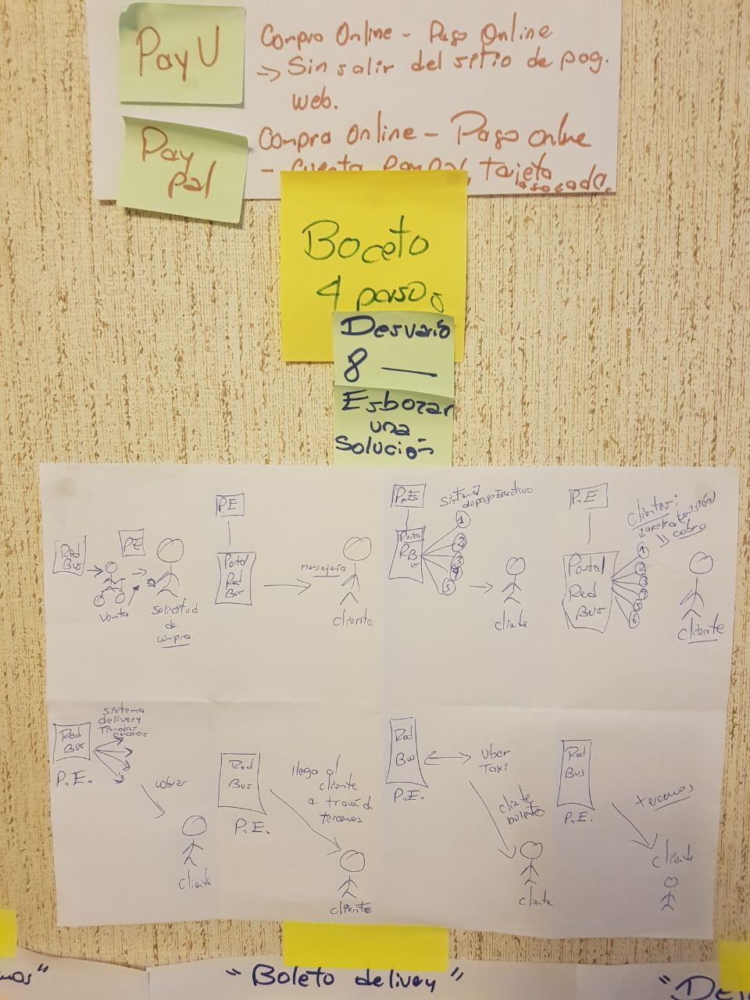
        
3. Posterior se esboza soluciones, una en cada hoja.
    
    * Se esbozan soluciones, según el desvario en 8.
    

 ### DÍA 3
    
 #### Objetivo: Definir la solución del reto lo más claro posible.
 
 #### Actividades:
 
1. Decidir las solución de nuestro proyecto.
     
    * Teniendo en cuenta lo trabajado el día de ayer, se decidió unir la solución de dos de las tres hojas del mural.
    * Solución a proponer: "Diseñar un nuevo medio de pago: plataforma delivey - DeliBus"
      
    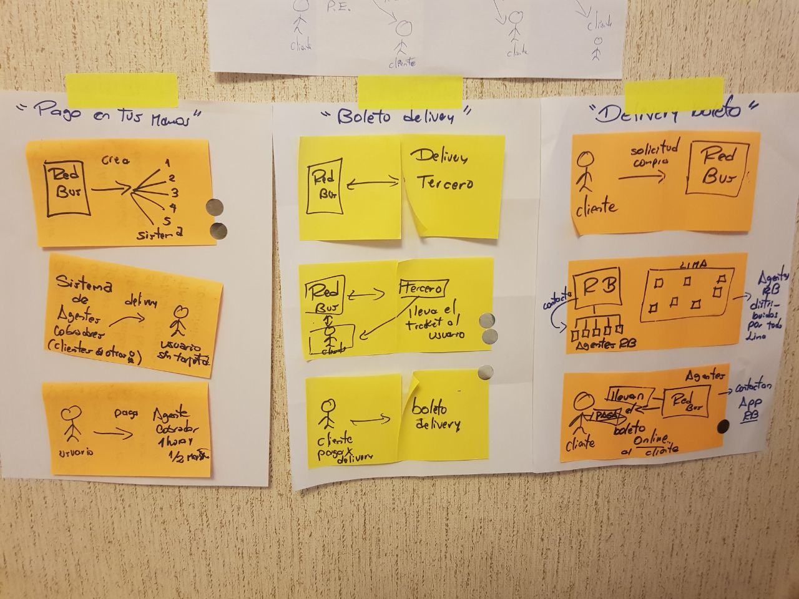
      
2. Realizar el guión gráfico
    
    * Antes de prototipar, es necesario plasmar la solución y contarlo de manera fácil.
    * Detalle del guión gráfico:
    - Antes del encuentro: El cliente compra un pasaje por Delivery-DeliBus, redBus le solicita su ubicación o punto de encuentro para la transacción; posterior busca un agente DeliBus, indicándole el tiempo estimado de encuentro y envía un código QR al cliente.
    - En el momento del encuentro: El Agente DeliBus escanea el código QR, para comenzar con la transacción, recibe el dinero, y automáticamente llega el boleto al cliente a la plataforma.
    - Luego del encuentro: El cliente descarga el boleto.

    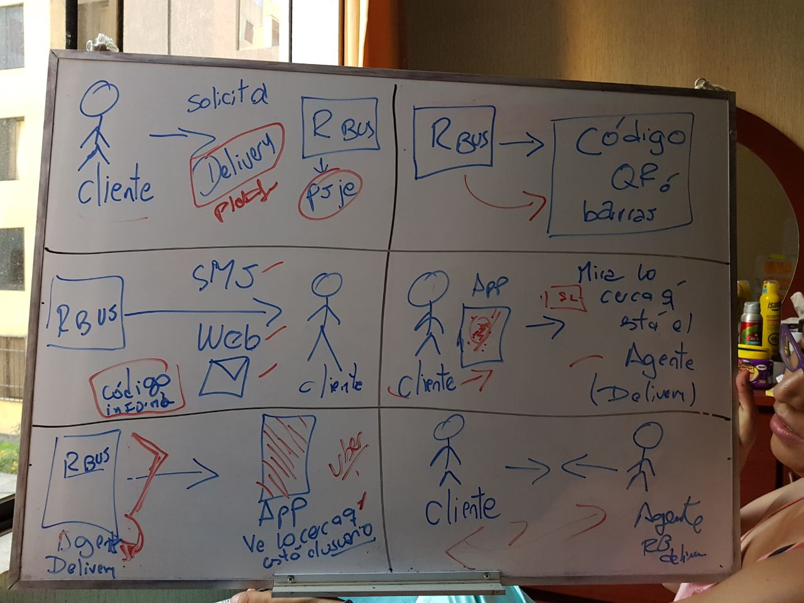
        
 ### DÍA 4
    
 #### Objetivo: Construir el prototipo lo más real posible.
 
 #### Actividades:
 
1. Realizar el prototipo en papel.
     
    * Conociendo el guión gráfico, se pasa todas las actividades necesarias a la aplicación.
      
    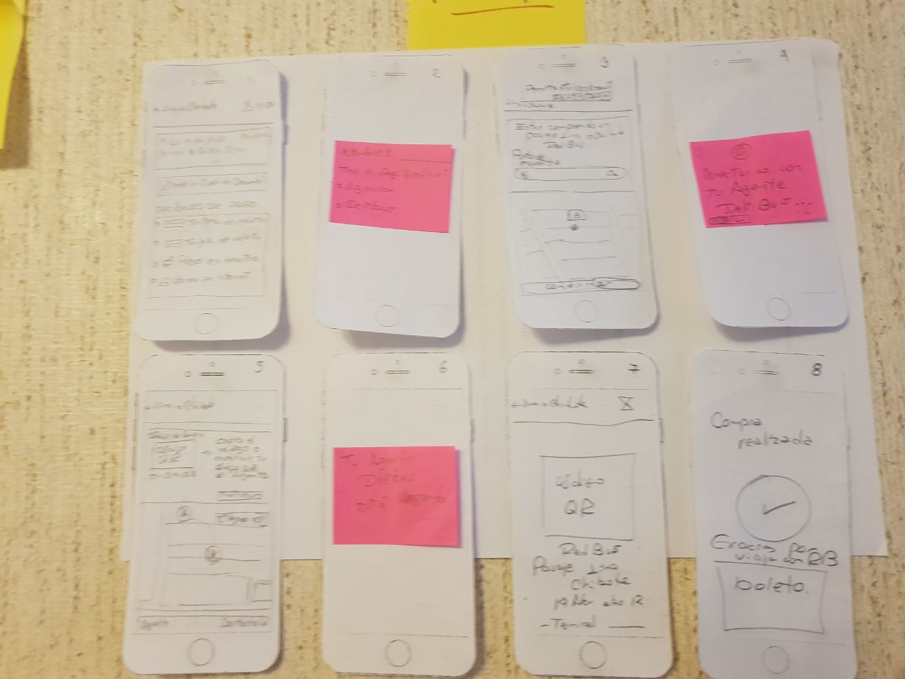
      
2. Realizar el prototipo en alta fidelidad.
    
    * Se utilizó la herramienta Marvel.
    
    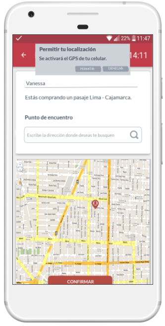
        
    * Link del prototipo de alta fidelidad:  https://marvelapp.com/50dj9ih/screen/40527932
 
 ### DÍA 5
    
 #### Objetivo: Conocer cuán factible es nuestra solución.
 
 #### Actividades:
 
1. Realizar entrevistas con el prototipo en marvel.
     
    * Se realiza el testeo del producto, con cuatro personas; quienes refieren:
    Participante 1:
          - Mejorar las letras son muy pequeñas en relación a las primeras vistas.
          - Se entiende el flujo de delivery.
          - Usaría el servicio de delivery, aunque me sería más útil tener mejor contacto con mi agente de redBus, para contactar una horario que me convenga.
        
    Participante 2:
          - Me parece un buen producto, nunca usé redBus.
          - La idea que alguien venga a entregarte el pasaje, me parece buena, ya no haría necesidad de ir a buscar un banco o agente.
        
    Participante 3:
          - Se tiene que definir quién es el agente, es un tercero o una persona común y corriente.
          
    Participante 4:
          - Tener cuidado con la interacción de opciones de pago, son radio buttons pero reaccionan como un select o un acordeon.
        
2. Determinar los aspectos para mejorar el producto. "Aprender"
    
    * Se mejoró el prototipo con las observaciones obtenidas de los testeos iniciales.
         
## Herramientas tecnológicas utilizadas

   * Trello
   * Marvel app
   * Paint
   * AZ Screen Recorder
   
## Feedback

   * Link del prototipo final:  https://marvelapp.com/50dj9ih/screen/40527149